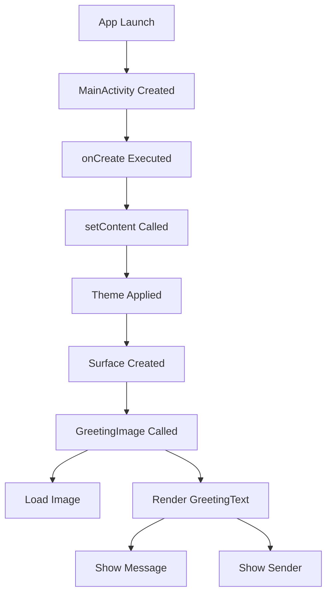

# Happy Birthday Android App Documentation

## Overview

This is a simple Android application built using Jetpack Compose.  
Yeh app ek birthday greeting message show karta hai with a background image.

Application ka main purpose hai ek clean UI create karna jisme text aur image overlay properly render ho.

---

## 1. Imports

### Core Android

```kotlin
import android.os.Bundle
```
Used for Activity lifecycle state handling.  
Yeh Activity ke lifecycle state ko manage karne ke liye use hota hai.

```kotlin
import androidx.activity.ComponentActivity
```
Base class for activities that use Jetpack Compose.  
Yeh Compose based Activity ka base class hai.

```kotlin
import androidx.activity.compose.setContent
```
Sets Compose UI as the Activity content.  
Iska use karke hum XML ke bina direct Compose UI set karte hain.

---

### Compose Layout

```kotlin
import androidx.compose.foundation.layout.Arrangement
import androidx.compose.foundation.layout.Column
import androidx.compose.foundation.layout.fillMaxSize
import androidx.compose.foundation.layout.padding
import androidx.compose.foundation.layout.Box
```
Provides layout structures like Column and Box.  
Column vertical layout ke liye use hota hai aur Box overlapping elements ke liye.

---

### UI Elements

```kotlin
import androidx.compose.foundation.Image
```
Used to display images.  
Image component UI me image render karta hai.

```kotlin
import androidx.compose.material3.MaterialTheme
import androidx.compose.material3.Surface
import androidx.compose.material3.Text
```
Material UI components provide styling and structure.  
Text text show karta hai, Surface background layer deta hai, aur MaterialTheme design system handle karta hai.

---

### Compose Runtime

```kotlin
import androidx.compose.runtime.Composable
```
Marks a function as a Composable UI function.  
Is annotation se function UI component ban jata hai.

---

### UI Styling

```kotlin
import androidx.compose.ui.Alignment
import androidx.compose.ui.Modifier
```
Alignment positioning ke liye aur Modifier UI customization ke liye use hota hai.

```kotlin
import androidx.compose.ui.text.style.TextAlign
```
Text alignment control karta hai.

```kotlin
import androidx.compose.ui.unit.dp
import androidx.compose.ui.unit.sp
```
dp spacing ke liye aur sp text size ke liye use hota hai.

---

### Resources and Scaling

```kotlin
import androidx.compose.ui.res.painterResource
```
Drawable resources load karne ke liye use hota hai.

```kotlin
import androidx.compose.ui.layout.ContentScale
```
Image scaling control karta hai.

---

### Preview

```kotlin
import androidx.compose.ui.tooling.preview.Preview
```
Android Studio me preview show karne ke liye.

---

### Theme

```kotlin
import com.example.happyybirthday.ui.theme.HappyyBirthdayTheme
```
Custom theme jo app ke colors aur styling define karta hai.

---

## 2. Main Activity

```kotlin
class MainActivity : ComponentActivity()
```

Yeh app ka entry point hai.

---

### onCreate Function

```kotlin
override fun onCreate(savedInstanceState: Bundle?)
```

#### Flow

1. super.onCreate() call hota hai  
2. setContent ke through Compose UI load hota hai  
3. Theme apply hoti hai  
4. Surface container create hota hai  
5. GreetingImage function call hota hai  

---

### UI Setup

```kotlin
setContent {
    HappyyBirthdayTheme {
        Surface(
            modifier = Modifier.fillMaxSize(),
            color = MaterialTheme.colorScheme.background
        ) {
            GreetingImage(
                message = "Happy Birthday Subh!",
                from = "From Mistu",
                modifier = Modifier.fillMaxSize()
            )
        }
    }
}
```

Surface ek base layout hai jo full screen cover karta hai.  
Iske andar actual UI render hota hai.

---

## 3. GreetingText Composable

```kotlin
@Composable
fun GreetingText(message: String, from: String, modifier: Modifier = Modifier)
```

### Purpose

Yeh function message aur sender ka naam display karta hai.

---

### Layout Structure

```kotlin
Column(
    verticalArrangement = Arrangement.Center,
    modifier = modifier
)
```

Column vertical arrangement provide karta hai jisme elements center me aligned hain.

---

### Message Text

```kotlin
Text(
    text = message,
    fontSize = 100.sp,
    lineHeight = 116.sp,
    textAlign = TextAlign.Center
)
```

Yeh main greeting message hai jo large font size me show hota hai.

---

### Sender Text

```kotlin
Text(
    text = from,
    fontSize = 36.sp,
    modifier = Modifier
        .padding(16.dp)
        .align(alignment = Alignment.End)
)
```

Yeh sender ka naam hai jo bottom-right aligned hai.

---

## 4. GreetingImage Composable

```kotlin
@Composable
fun GreetingImage(message: String, from: String, modifier: Modifier = Modifier)
```

### Purpose

Yeh background image ke upar text overlay karta hai.

---

### Step 1: Load Image

```kotlin
val image = painterResource(R.drawable.life_66)
```

Drawable resource se image load hoti hai.

---

### Step 2: Box Layout

```kotlin
Box(modifier = modifier)
```

Box multiple elements ko stack karne ke liye use hota hai.

---

### Step 3: Background Image

```kotlin
Image(
    painter = image,
    contentDescription = null,
    modifier = Modifier.fillMaxSize(),
    contentScale = ContentScale.Crop,
    alpha = 0.5F
)
```

Image full screen fill karti hai, crop scaling ke saath.  
Alpha 0.5 hone se image thodi transparent ho jati hai.

---

### Step 4: Overlay Text

```kotlin
GreetingText(
    message = message,
    from = from,
    modifier = Modifier
        .fillMaxSize()
        .padding(8.dp)
)
```

Text image ke upar render hota hai.

---

## 5. Preview Function

```kotlin
@Preview(showBackground = true)
@Composable
fun BirthdayCardPreview() {
    HappyyBirthdayTheme {
        GreetingImage(
            message = "Happy Birthday Sam!",
            from = "From Emma"
        )
    }
}
```

Yeh Android Studio me UI preview dikhane ke liye use hota hai bina app run kiye.

---

## 6. Application Flow



---

## 7. Code Architecture Summary

- MainActivity entry point hai  
- setContent Compose UI load karta hai  
- GreetingImage main UI container hai  
- Box layering handle karta hai  
- GreetingText content display karta hai  

---

## 8. Future Improvements

- Dynamic user input add kar sakte ho  
- Animation add kar sakte ho  
- Multiple themes implement kar sakte ho  
- ViewModel use karke state management improve kar sakte ho  

---

## 9. Key Concepts Used

- Jetpack Compose  
- Composable Functions  
- Layout System (Column, Box)  
- Resource Handling  
- UI Layering  

---

## Conclusion

Yeh project ek basic lekin clean implementation hai Jetpack Compose ka.  
Structure modular hai aur easily scalable hai future enhancements ke liye.
